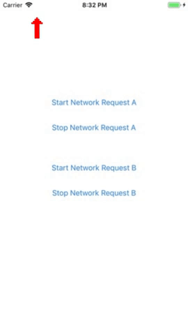

# WQNetworkActivityIndicator

<p align="center">
  
</p>

<!--[](https://travis-ci.org/quanvo87/WQNetworkActivityIndicator)-->
[](http://cocoapods.org/pods/WQNetworkActivityIndicator)
[](http://cocoapods.org/pods/WQNetworkActivityIndicator)
[](http://cocoapods.org/pods/WQNetworkActivityIndicator)
[](https://swift.org)

Provides an easy way to manage the Network Activity Indicator with multiple network requests.

## Features

- [x] Prevents a network request from prematurely hiding the Network Activity Indicator if there are still other network requests in progress
- [x] Prevents errors in the event that `show()` and `hide()` calls become unbalanced
- [x] Has an optional timeout built into `show()`, in case a network request takes too long, or the calls become unbalanced

## Example

To run the example project, clone the repo, and run `pod install` from the Example directory first.

## Installation

WQNetworkActivityIndicator is available through [CocoaPods](http://cocoapods.org). To install
it, simply add the following line to your Podfile:

```ruby
pod 'WQNetworkActivityIndicator'
```

## Usage

#### Show the Network Activity Indicator:

```swift
WQNetworkActivityIndicator.shared.show()
```

#### Hide the Network Activity Indicator:

```swift
WQNetworkActivityIndicator.shared.hide()
```

#### Multiple network requests:

```swift
WQNetworkActivityIndicator.shared.show()

networkRequestA() {
    WQNetworkActivityIndicator.shared.hide()
}

WQNetworkActivityIndicator.shared.show()

networkRequestB() {
    WQNetworkActivityIndicator.shared.hide()
}
```

> The Network Activity Indicator will stop showing only when both requests are done.

#### Force the Network Activity Indicator to hide:

```swift
WQNetworkActivityIndicator.shared.hide(force: true)
```

#### Change the timeout

The `timeout` defaults to `10` seconds. Set it to `0` to disable it:

```swift
WQNetworkActivityIndicator.shared.timeout = 0
```

## Authors

- [Quan Vo](https://github.com/quanvo87)
- [Wilson Ding](https://github.com/dingwilson)

Based off [MXNetworkActivityIndicator](https://github.com/g20ready/MXNetworkActivityIndicator).

## License

WQNetworkActivityIndicator is available under the MIT license. See the LICENSE file for more info.
